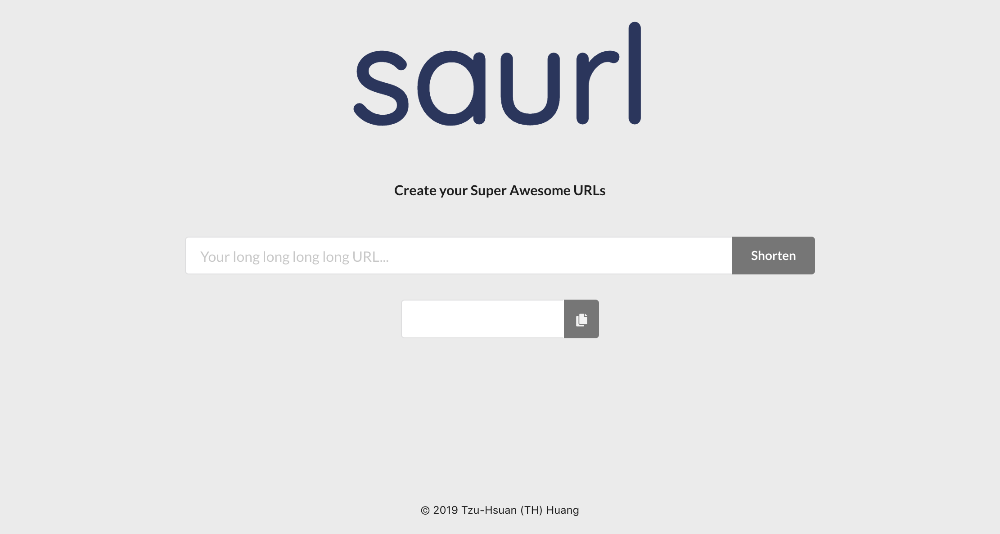

# [saurl](https://saurl.io)


Super Awesome URLs Shortener. Try it: https://saurl.io

## Run on your local machine
### Preparation
1. [Install Docker](https://docs.docker.com/install/)
    - [Install Docker Engine - Community on Ubuntu](https://docs.docker.com/install/linux/docker-ce/ubuntu/)
    - [Install Docker Engine - Community on CentOS](https://docs.docker.com/install/linux/docker-ce/centos/)
    - [Install Docker Desktop on Mac](https://docs.docker.com/docker-for-mac/install/)
    - [Install Docker Desktop on Windows](https://docs.docker.com/docker-for-windows/install/)
    - [Other information](https://docs.docker.com/install/)
2. [Install Docker Compose](https://docs.docker.com/compose/install/)
    - Mac users do not need to install Compose separately.

### QuickStart
Run the following commands to launch the application on http://localhost:16384/
```
$ docker-compose up
```


